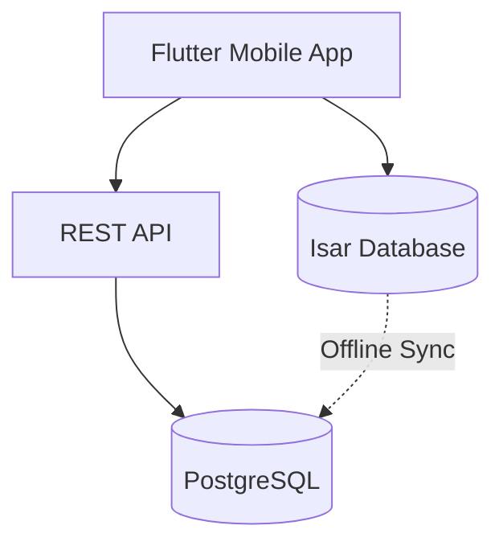
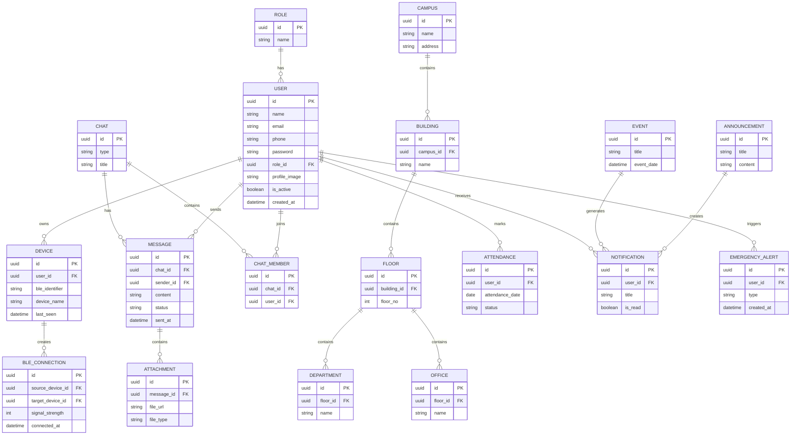
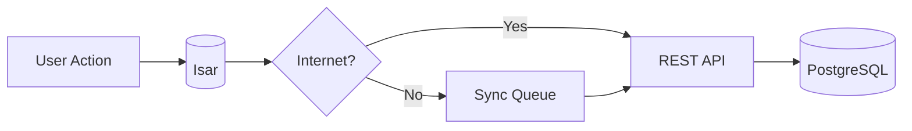

---

## Database Architecture



---

# Entity Relationship Diagram (ERD)



---

# Core Tables

## Authentication

| Table | Purpose                  |
| ----- | ------------------------ |
| users | User accounts            |
| roles | User roles & permissions |

---

## Campus

| Table       | Purpose                |
| ----------- | ---------------------- |
| campuses    | Campus information     |
| buildings   | Buildings              |
| floors      | Building floors        |
| departments | Academic departments   |
| offices     | Administrative offices |

---

## Bluetooth Mesh

| Table           | Purpose                  |
| --------------- | ------------------------ |
| devices         | Registered devices       |
| ble_connections | Nearby BLE connections   |
| mesh_nodes      | Mesh routing information |

---

## Communication

| Table        | Purpose           |
| ------------ | ----------------- |
| chats        | Chat rooms        |
| chat_members | Chat participants |
| messages     | Chat messages     |
| attachments  | Shared files      |

---

## Academic

| Table               | Purpose             |
| ------------------- | ------------------- |
| attendance          | Student attendance  |
| attendance_sessions | Attendance sessions |

---

## Campus Services

| Table            | Purpose              |
| ---------------- | -------------------- |
| events           | Campus events        |
| announcements    | Notices              |
| notifications    | User notifications   |
| emergency_alerts | Emergency broadcasts |
| visitors         | Visitor records      |

---

# Table Relationships

```text
Campus
 └── Building
      └── Floor
           ├── Department
           └── Office

User
 ├── Role
 ├── Device
 ├── Attendance
 └── Chat

Chat
 ├── Members
 └── Messages
         └── Attachments

Device
 └── BLE Connections
```

---

# Primary Keys

| Table         | Primary Key     |
| ------------- | --------------- |
| users         | user_id (UUID)  |
| roles         | role_id         |
| campuses      | campus_id       |
| buildings     | building_id     |
| floors        | floor_id        |
| departments   | department_id   |
| offices       | office_id       |
| devices       | device_id       |
| chats         | chat_id         |
| messages      | message_id      |
| attendance    | attendance_id   |
| notifications | notification_id |

---

# Foreign Keys

| Child Table  | Parent Table |
| ------------ | ------------ |
| users        | roles        |
| buildings    | campuses     |
| floors       | buildings    |
| departments  | floors       |
| offices      | floors       |
| devices      | users        |
| attendance   | users        |
| chat_members | users        |
| chat_members | chats        |
| messages     | chats        |
| attachments  | messages     |

---

# Offline Storage (Isar)

```text
Cached Data

• User Session
• Profile
• Messages
• Departments
• Offices
• Attendance
• Notifications
• BLE Devices
• Sync Queue
```

---

# Synchronization Flow



---

# Database Design Principles

* UUID Primary Keys
* Third Normal Form (3NF)
* Soft Delete
* Audit Logging
* Indexed Queries
* Offline-First Storage
* Automatic Synchronization
* ACID Transactions
* Secure Data Access

---
