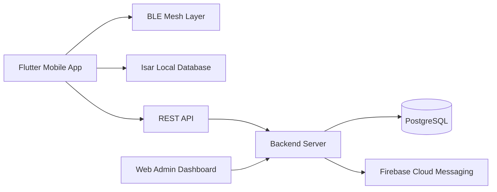
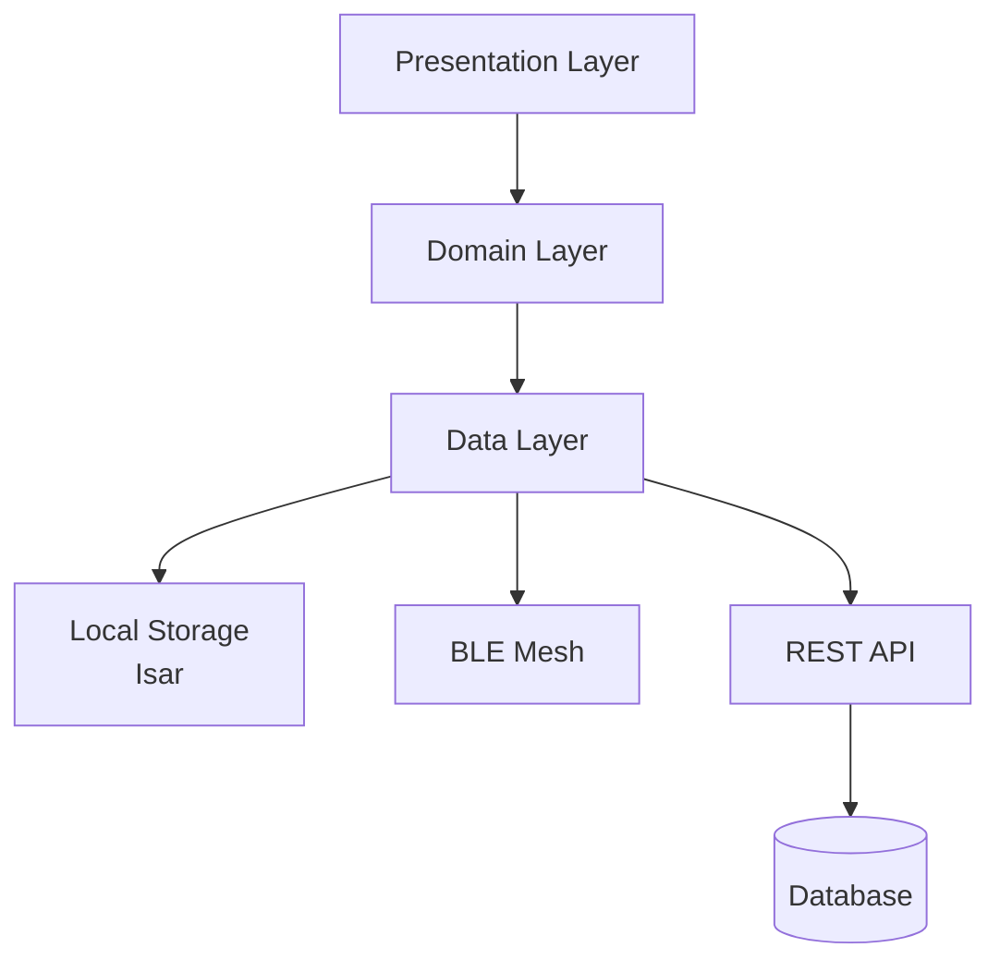
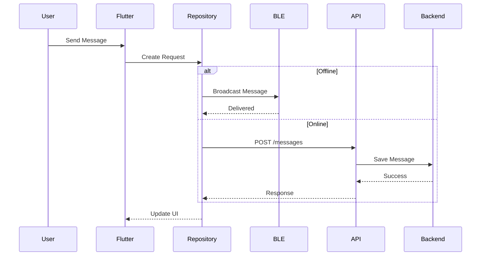
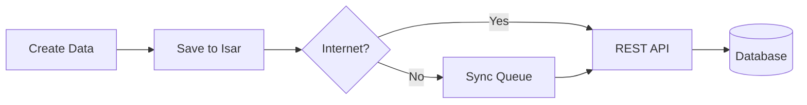

# HLD.md

# High-Level Design (HLD)

> **Project:** CampusMesh
> **Architecture:** Offline-First Smart Campus Platform

---

## System Overview

CampusMesh is an offline-first mobile platform that combines Bluetooth Low Energy (BLE) Mesh networking with cloud synchronization to provide uninterrupted campus communication and services.

---

# High-Level Architecture

---

# Layered Architecture

---

---

# Communication Flow

---

# Offline Synchronization

---

# Technology Stack

| Layer            | Technology               |
| ---------------- | ------------------------ |
| Mobile           | Flutter                  |
| State Management | Riverpod                 |
| Navigation       | GoRouter                 |
| Local Storage    | Isar                     |
| Networking       | Dio                      |
| Bluetooth        | flutter_blue_plus        |
| Backend          | Node.js + Express        |
| Database         | PostgreSQL               |
| Notifications    | Firebase Cloud Messaging |

---

# Design Principles

* Offline First
* Clean Architecture
* SOLID Principles
* Repository Pattern
* Dependency Injection
* Modular Development
* Secure by Design

---

# Deployment Overview

---

> **Outcome:** A scalable, modular, and resilient architecture that enables uninterrupted campus communication, discovery, and collaboration, even without internet connectivity.
