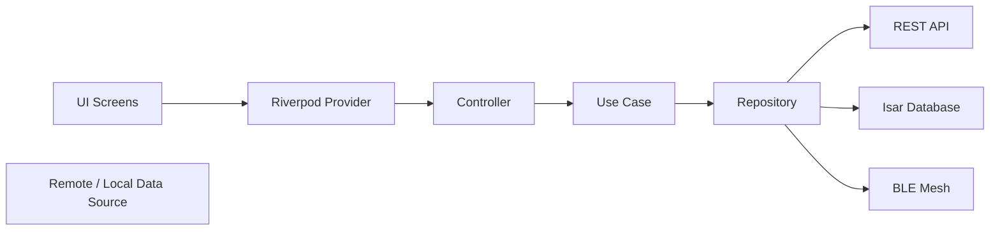
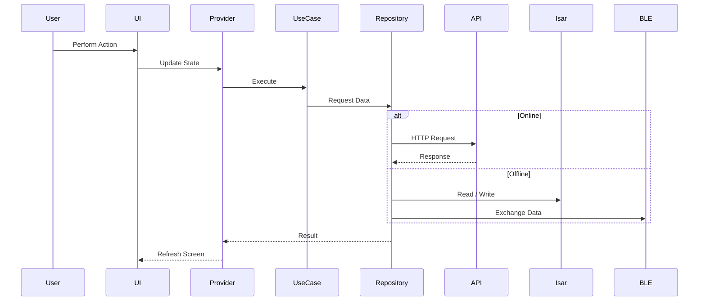

# LLD.md

# Low-Level Design (LLD)

**Project:** CampusMesh
**Version:** 1.0

---

## Overview

This document describes the internal design of the CampusMesh application. The project follows **Clean Architecture**, **Repository Pattern**, **Dependency Injection**, and **SOLID principles** to ensure scalability, maintainability, and testability.

---

# Module Breakdown

| Module           | Responsibility                               |
| ---------------- | -------------------------------------------- |
| Authentication   | Login, registration, session management      |
| BLE Mesh         | Device discovery, connections, data exchange |
| Messaging        | One-to-one and group chat                    |
| Campus Directory | Departments, offices, buildings              |
| Navigation       | Indoor campus navigation                     |
| Attendance       | Mark and sync attendance                     |
| Notifications    | Events and announcements                     |
| Emergency        | SOS and emergency broadcasts                 |
| Profile          | User information and preferences             |
| Admin            | Dashboard and campus management              |

---

# Feature Architecture

```text
Feature
│
├── Presentation
│   ├── Pages
│   ├── Widgets
│   ├── Providers
│   └── Controllers
│
├── Domain
│   ├── Entities
│   ├── Repositories
│   └── Use Cases
│
└── Data
    ├── Models
    ├── DTOs
    ├── Mappers
    ├── Data Sources
    └── Repository Implementations
```

---

# Clean Architecture Flow



---

# Folder Structure

```text
lib/
├── core/
├── config/
├── shared/
└── features/
    ├── authentication/
    ├── bluetooth/
    ├── chat/
    ├── attendance/
    ├── navigation/
    ├── directory/
    ├── emergency/
    ├── notifications/
    ├── profile/
    └── settings/
```

---

# Data Flow



---

# Dependency Injection

```text
App Start
    │
    ▼
Service Locator
    │
    ├── Repositories
    ├── Use Cases
    ├── Data Sources
    ├── BLE Services
    └── Controllers
```

---

# Design Patterns

| Pattern              | Usage                     |
| -------------------- | ------------------------- |
| Clean Architecture   | Layer separation          |
| Repository Pattern   | Data abstraction          |
| Dependency Injection | Object creation           |
| Factory Pattern      | Model creation            |
| Observer Pattern     | BLE event listeners       |
| Strategy Pattern     | Routing & sync strategies |
| Singleton            | Shared services           |

---

# Error Handling

* Global exception handling
* Network timeout handling
* BLE connection retry
* Offline fallback
* Input validation
* API error mapping

---

# Security

* JWT Authentication
* Secure token storage
* Role-based access control (RBAC)
* HTTPS communication
* BLE payload encryption
* Session validation

---

# Performance

* Lazy loading
* Local caching with Isar
* Optimized BLE scanning
* Background synchronization
* Efficient state updates with Riverpod

---

# Testing Strategy

* Unit Tests
* Widget Tests
* Integration Tests
* BLE Simulation Tests
* Manual QA Checklist

---

# Development Principles

* Single Responsibility Principle (SRP)
* Open/Closed Principle (OCP)
* Dependency Inversion Principle (DIP)
* Modular feature development
* Reusable components
* Production-ready code

---

> **LLD Goal:** Define the internal structure of each module, data flow, and implementation approach to guide development while maintaining a scalable and maintainable architecture.
